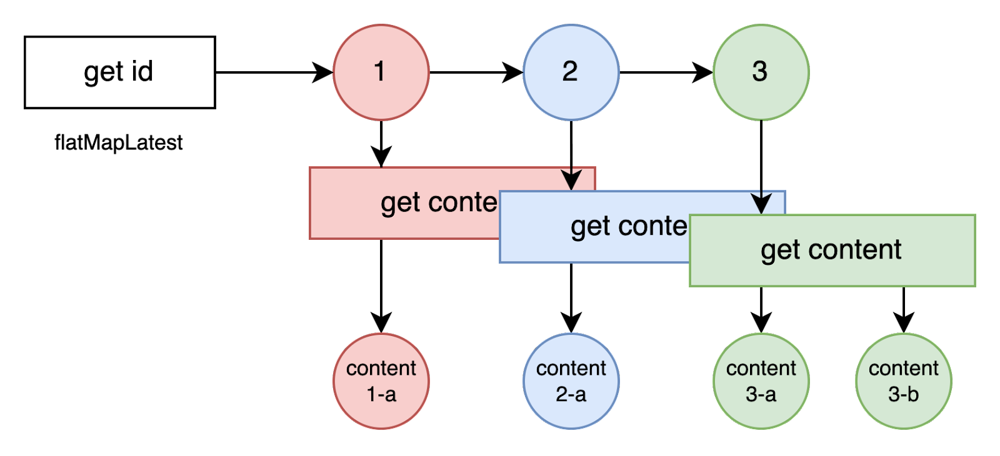
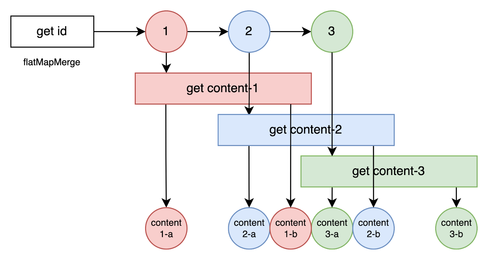
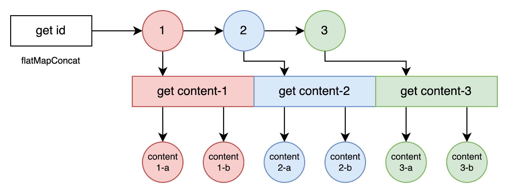
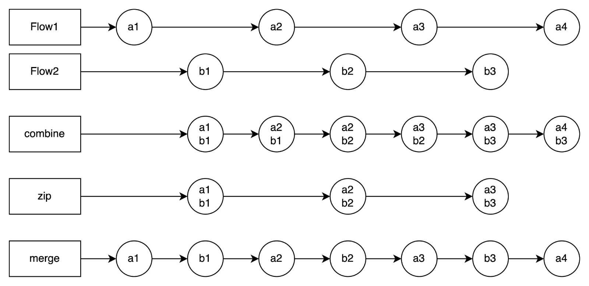
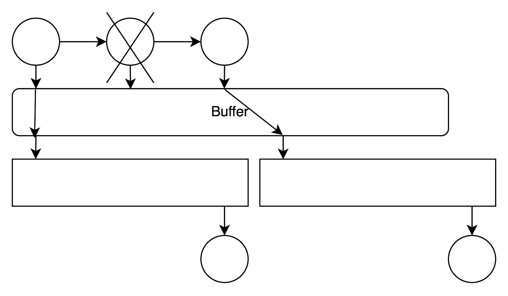
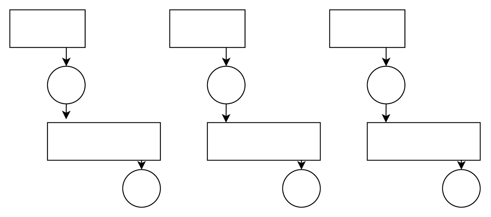
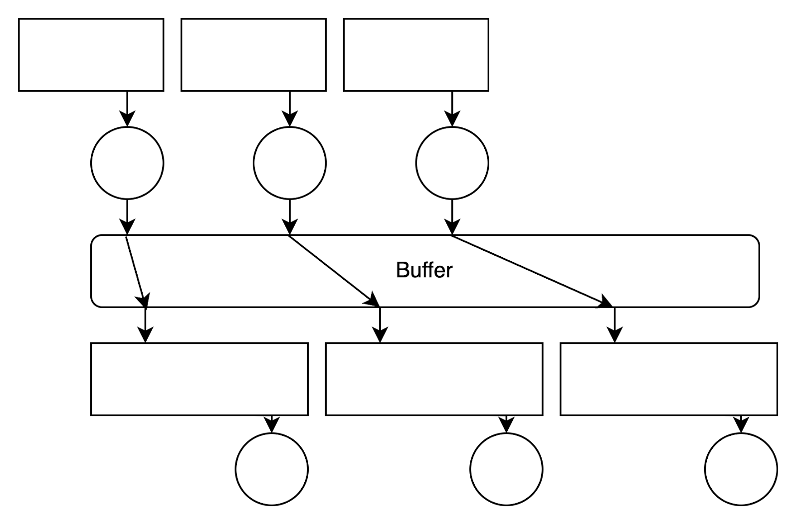

#TODO
- Group Back Pressure related?
- Visualization

#Reason of using flow
- Callback hell
- mvvm
- Capability

#Flow operations
https://flowmarbles.com/

##Merge
###flatMapLatest

- Drop old flow.
- E.g A single view to show a continued updating data.
###flatMapMerge

- concurrency
- E.g A list which follows local sorting logic.
###flatMapConcat

- Same as merge(concurrency = 1).
- E.g A list which follows api order.
###Combine, Zip, Merge

- Similar to flat, but no dependency between flows

---

##Transform
###Collection-like
- take / drop, filter
- onEach, withIndex
- map, mapLatest
- runningFold, runningReduce

---

##Delay / Sampling / Distinct
- Debounce
- Sample
- DistinctUntilChanged

---

##Terminal
###collect
- collect / collectLatest / collectIndexed / collectAsState
###launchIn
- Async launch, just a sugar
- Handle result by intermediate operator: onEach, onComplete, catch…
###collection-like
- toList / toSet / toCollection
- first / last, fold / reduce, single

---

##Context
###Conflate, latest of upstream

###Buffer
- capacity, overflow

###FlowOn
- Change the coroutine context of upstream operations.
- First come first serve. Can declare context inside the repository, downstream won't be able to change context.
- withContext inside collect / transform scope wont work
- For collect(), consider use withContext outside collect
###Cancellable
- flowOf / asFlow / (object : Flow) are not cancellable (UnsafeFlow). Collector will still alive after coroutine context is dead
- flow<T>{} builder is cancellable

---

##Error / Emitters
###Catch
- Only apply to upstream (actually can catch downstream error, but ignored)
- Can emit when caught (make use of Result<T>)
###Retry
- With condition (depends on count / exception)
- With delay
- Can pass retry info by emitting with Result<T>
###onComplete
- ≈ finally
- Can catch downstream (will still throw)
- Cannot emit when have error
- emit will trigger downstream operations
###Emitter: onStart, onEmpty
###Timeout
- withTimeout inside flowBuilder (not suggest, might not cancellable)
- Collect flow inside withTimeout{}

---

##ChannelFlow

---

##CallbackFlow
- awaitClose / cancel

---

##Capability with RxJava

---

##Shared / StateFlow
- Compare with LiveData
- SingleLiveEvent issue
- Emit / Observe (Lifecycle / Dispatchers.Main / collectAsState)
- Future: prop type with different visibility
- stateIn / sharedIn
###Capability
- LiveData
- Compose State

---
